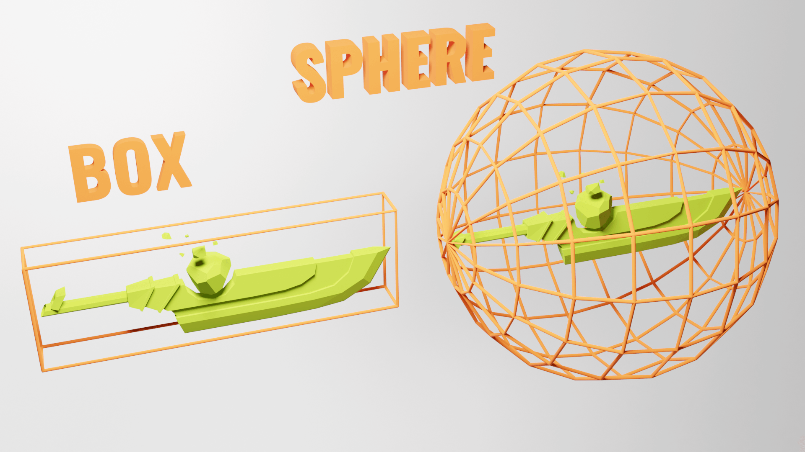
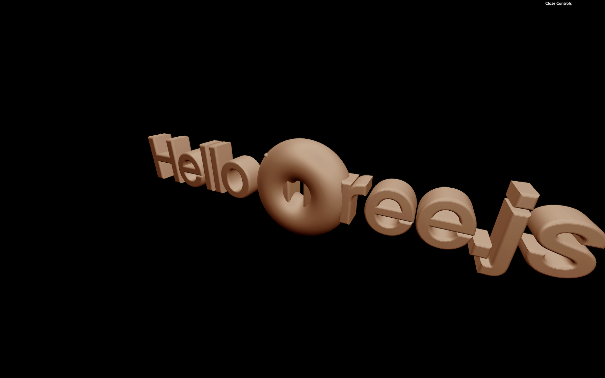

<br/>

## Need to do

<br/>


```javascript
import { FontLoader } from 'three/examples/jsm/loaders/FontLoader.js'

const fontLoader = new FontLoader()

fontLoader.load(
    '/fonts/helvetiker_regular.typeface.json',
    (font) =>
    {
        console.log('loaded')
    }
)
```

<br/>


```javascript
import { TextGeometry } from 'three/examples/jsm/geometries/TextGeometry.js'
```


```javascript
fontLoader.load(
    '/fonts/helvetiker_regular.typeface.json',
    (font) =>
    {
        const textGeometry = new TextGeometry(
            'Hello Three.js',
            {
                font: font,
                size: 0.5,
                depth: 0.2,
                curveSegments: 12,
                bevelEnabled: true,
                bevelThickness: 0.03,
                bevelSize: 0.02,
                bevelOffset: 0,
                bevelSegments: 5
            }
        )
        const textMaterial = new THREE.MeshBasicMaterial()
        const text = new THREE.Mesh(textGeometry, textMaterial)
        scene.add(text)
    }
)
```


```javascript
const textMaterial = new THREE.MeshBasicMaterial({ wireframe: true })
```

<br/>

<br/>

---

### Center text




```javascript
textGeometry.computeBoundingBox()
```


```javascript
textGeometry.translate(
    - textGeometry.boundingBox.max.x * 0.5,
    - textGeometry.boundingBox.max.y * 0.5,
    - textGeometry.boundingBox.max.z * 0.5
)
```


```javascript
textGeometry.translate(
    - (textGeometry.boundingBox.max.x - 0.02) * 0.5, // Subtract bevel size
    - (textGeometry.boundingBox.max.y - 0.02) * 0.5, // Subtract bevel size
    - (textGeometry.boundingBox.max.z - 0.03) * 0.5  // Subtract bevel thickness
)
```


```javascript
textGeometry.center()
```

---

<br/>

## **Add a matcap material **

<br/>


```javascript
const matcapTexture = textureLoader.load('/textures/matcaps/1.png')
```


```javascript
const matcapTexture = textureLoader.load('/textures/matcaps/1.png')
matcapTexture.colorSpace = THREE.SRGBColorSpace
```


```javascript
const textMaterial = new THREE.MeshMatcapMaterial({ matcap: matcapTexture })
```

## **Add objects **


```javascript
for(let i = 0; i < 100; i++)
{

}
```


```javascript
for(let i = 0; i < 100; i++)
{
    const donutGeometry = new THREE.TorusGeometry(0.3, 0.2, 20, 45)
    const donutMaterial = new THREE.MeshMatcapMaterial({ matcap: matcapTexture })
    const donut = new THREE.Mesh(donutGeometry, donutMaterial)
    scene.add(donut)
}
```




```javascript
donut.position.x = (Math.random() - 0.5) * 10
donut.position.y = (Math.random() - 0.5) * 10
donut.position.z = (Math.random() - 0.5) * 10
```


```javascript
donut.rotation.x = Math.random() * Math.PI
donut.rotation.y = Math.random() * Math.PI
```


```javascript
const scale = Math.random()
donut.scale.set(scale, scale, scale)
```

---

## **Optimize **


```javascript
const donutGeometry = new THREE.TorusGeometry(0.3, 0.2, 20, 45)
const donutMaterial = new THREE.MeshMatcapMaterial({ matcap: matcapTexture })

for(let i = 0; i < 100; i++)
{
    // ...
}
```


```javascript
const material = new THREE.MeshMatcapMaterial({ matcap: matcapTexture })

// ...

const text = new THREE.Mesh(textGeometry, material)

// ...

for(let i = 0; i < 100; i++)
{
    const donut = new THREE.Mesh(donutGeometry, material)

    // ...
}
```

<br/>

