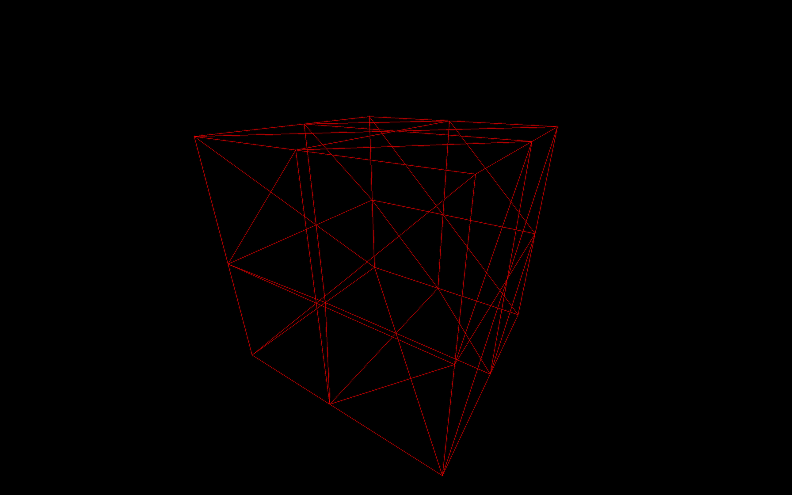
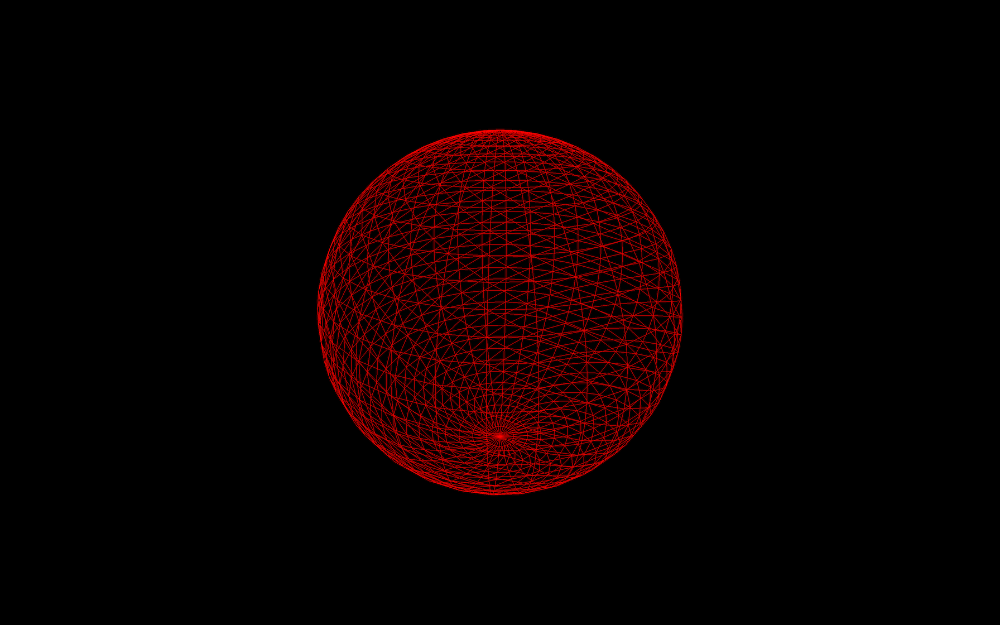
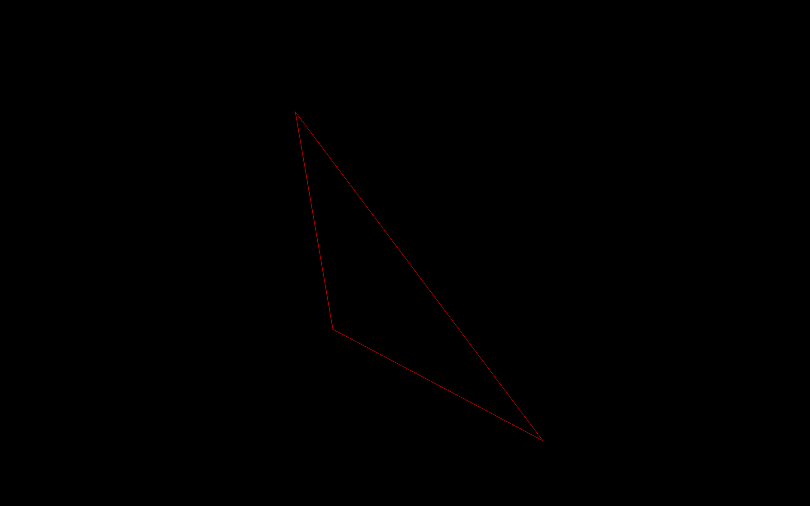
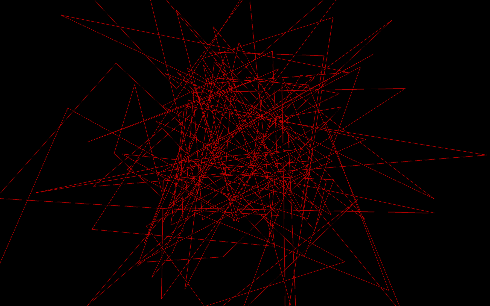

<br/>

<br/>

- [BoxGeometry](https://threejs.org/docs/#api/en/geometries/BoxGeometry) To create a box.

- [PlaneGeometry](https://threejs.org/docs/#api/en/geometries/PlaneGeometry) To create a rectangle plane.

- [CircleGeometry](https://threejs.org/docs/#api/en/geometries/CircleGeometry) To create a disc or a portion of a disc (like a pie chart).

- [ConeGeometry](https://threejs.org/docs/#api/en/geometries/ConeGeometry) To create a cone or a portion of a cone. You can open or close the base of the cone.

- [CylinderGeometry](https://threejs.org/docs/#api/en/geometries/CylinderGeometry) To create a cylinder. You can open or close the ends of the cylinder and you can change the radius of each end.

- [RingGeometry](https://threejs.org/docs/#api/en/geometries/RingGeometry) To create a flat ring or portion of a flat circle.

- [TorusGeometry](https://threejs.org/docs/#api/en/geometries/TorusGeometry) To create a ring that has a thickness (like a donut) or portion of a ring.

- [TorusKnotGeometry](https://threejs.org/docs/#api/en/geometries/TorusKnotGeometry) To create some sort of knot geometry.

- [DodecahedronGeometry](https://threejs.org/docs/#api/en/geometries/DodecahedronGeometry) To create a 12 faces sphere. You can add details for a rounder sphere.

- [OctahedronGeometry](https://threejs.org/docs/#api/en/geometries/OctahedronGeometry) To create a 8 faces sphere. You can add details for a rounder sphere.

- [TetrahedronGeometry](https://threejs.org/docs/#api/en/geometries/TetrahedronGeometry) To create a 4 faces sphere (it won't be much of a sphere if you don't increase details). You can add details for a rounder sphere.

- [IcosahedronGeometry](https://threejs.org/docs/#api/en/geometries/IcosahedronGeometry) To create a sphere composed of triangles that have roughly the same size.

- [SphereGeometry](https://threejs.org/docs/#api/en/geometries/SphereGeometry) To create the most popular type of sphere where faces looks like quads (quads are just a combination of two triangles).

- [ShapeGeometry](https://threejs.org/docs/#api/en/geometries/ShapeGeometry) To create a shape based on a path.

- [TubeGeometry](https://threejs.org/docs/#api/en/geometries/TubeGeometry) To create a tube following a path.

- [ExtrudeGeometry](https://threejs.org/docs/#api/en/geometries/ExtrudeGeometry) To create an extrusion based on a path. You can add and control the bevel.

- [LatheGeometry](https://threejs.org/docs/#api/en/geometries/LatheGeometry) To create a vase or portion of a vase (more like a revolution).

- [TextGeometry](https://threejs.org/docs/?q=textge#examples/en/geometries/TextGeometry) To create a 3D text. You'll have to provide the font in typeface json format.

---

<br/>

- `**width**`: The size on the `**x**` axis

- `**height**`: The size on the `**y**` axis

- `**depth**`: The size on the `**z**` axis

- `**widthSegments**`: How many subdivisions in the `**x**` axis

- `**heightSegments**`: How many subdivisions in the `**y**` axis

- `**depthSegments**`: How many subdivisions in the `**z**` axis


```javascript
const geometry = new THREE.BoxGeometry(1, 1, 1, 2, 2, 2)
```

<br/>


```javascript
const material = new THREE.MeshBasicMaterial({ color: 0xff0000, wireframe: true })
```




```javascript
const geometry = new THREE.SphereGeometry(1, 32, 32)
```



---

# **Creating your own buffer geometry **


```javascript

// Create an empty BufferGeometry
const geometry = new THREE.BufferGeometry()
```


```javascript
const positionsArray = new Float32Array(9)

// First vertice
positionsArray[0] = 0
positionsArray[1] = 0
positionsArray[2] = 0

// Second vertice
positionsArray[3] = 0
positionsArray[4] = 1
positionsArray[5] = 0

// Third vertice
positionsArray[6] = 1
positionsArray[7] = 0
positionsArray[8] = 0
```


```javascript
const positionsArray = new Float32Array([
    0, 0, 0, // First vertex
    0, 1, 0, // Second vertex
    1, 0, 0  // Third vertex
])
```

<br/>


```javascript
const positionsAttribute = new THREE.BufferAttribute(positionsArray, 3)
```


```javascript
geometry.setAttribute('position', positionsAttribute)
```

<br/>


```javascript
// Create an empty BufferGeometry
const geometry = new THREE.BufferGeometry()

// Create a Float32Array containing the vertices position (3 by 3)
const positionsArray = new Float32Array([
    0, 0, 0, // First vertex
    0, 1, 0, // Second vertex
    1, 0, 0  // Third vertex
])

// Create the attribute and name it 'position'
const positionsAttribute = new THREE.BufferAttribute(positionsArray, 3)
geometry.setAttribute('position', positionsAttribute)
```



<br/>


```javascript
// Create an empty BufferGeometry
const geometry = new THREE.BufferGeometry()

// Create 50 triangles (450 values)
const count = 50
const positionsArray = new Float32Array(count * 3 * 3)
for(let i = 0; i < count * 3 * 3; i++)
{
    positionsArray[i] = (Math.random() - 0.5) * 4
}

// Create the attribute and name it 'position'
const positionsAttribute = new THREE.BufferAttribute(positionsArray, 3)
geometry.setAttribute('position', positionsAttribute)
```



