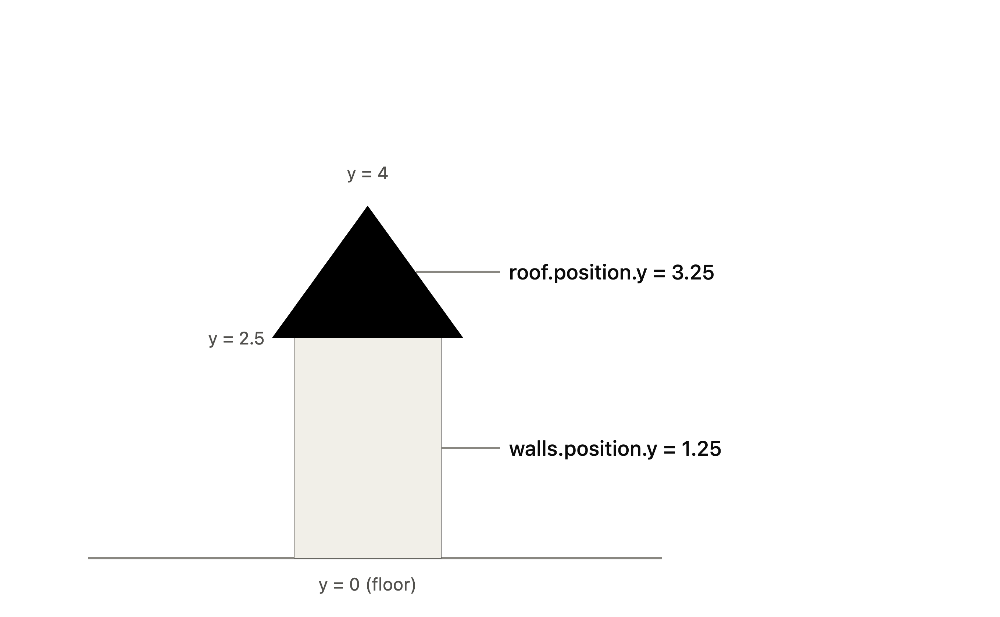
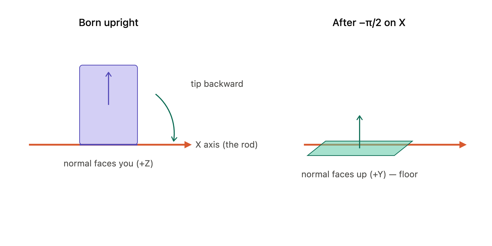

<br/>



<br/>

## 1. Imports and setup


```javascript
import * as THREE from 'three'
import { OrbitControls } from 'three/examples/jsm/controls/OrbitControls.js'
import { Timer } from 'three/addons/misc/Timer.js'
import GUI from 'lil-gui'
```

## 2. The floor


```javascript
const floor = new THREE.Mesh(
    new THREE.PlaneGeometry(20, 20),
    new THREE.MeshStandardMaterial({ alphaMap: floorAlphaTexture, transparent: true })
)
floor.rotation.x = -Math.PI * 0.5
```



- A full turn = 2π

- Half turn = π

- **Quarter turn = π / 2**, which is `Math.PI * 0.5`

## 3. The house group


```javascript
const house = new THREE.Group()
```

## 4. Walls


```javascript
new THREE.BoxGeometry(4, 2.5, 4)   // width, height, depth
walls.position.y += 1.25
```

## 5. Roof


```javascript
new THREE.ConeGeometry(3.5, 1.5, 4)  // radius, height, radialSegments
roof.position.y += 2.5 + 0.75
roof.rotation.y = Math.PI * 0.25
```

## 6. Door


```javascript
new THREE.PlaneGeometry(2.2, 2.2)
door.position.y = 1
door.position.z = 2 + 0.01
```

<br/>

## 7. Bushes


```javascript
const bushGeometry = new THREE.SphereGeometry(1, 16, 16)
const bushMaterial = new THREE.MeshStandardMaterial()
```


```javascript
bush1.scale.set(0.5, 0.5, 0.5)      // explicit per-axis
bush2.scale.setScalar(0.25)          // uniform shorthand
```

## 8. Graves — the loop


```javascript
for (let i = 0; i < 30; i++) {
    const angle = Math.random() * Math.PI * 2
    const radius = 3 + Math.random() * 7
    const x = Math.sin(angle) * radius
    const z = Math.cos(angle) * radius
    ...
}
```

- `angle = Math.random() * Math.PI * 2` → a uniform random direction over the full circle (0 to 2π).

- `radius = 3 + Math.random() * 7` → a distance between **3 and 10**. This creates an **annulus** (a ring with a hole), not a full disc.

<br/>

- The **3** is a floor — no grave is ever closer than 3 units to the center. That's deliberate: the house sits at the center, and its footprint reaches out about 2.83 units to its far corners. If you let radius go all the way down to 0, graves would spawn *inside the house and through the roof*. The 3 keeps them clear of the building.

- The **7** is the width of the band they're allowed to scatter across. 3 + 7 = 10, so graves land somewhere in the ring between distance 3 and distance 10.

<br/>

<br/>


```javascript
grave.position.y = Math.random() * 0.4          // 0 to 0.4: sink varies
grave.rotation.x = (Math.random() - 0.5) * 0.4  // small tilt
```

## 9. Lights


```javascript
new THREE.AmbientLight('#ffffff', 0.5)
new THREE.DirectionalLight('#ffffff', 1.5)
directionalLight.position.set(3, 2, -8)
```

- **Ambient** light hits everything uniformly from all directions — it's your flat "fill" so shadowed sides aren't pure black. No position, because it has no direction.

- **Directional** light is parallel rays from a direction (think sun). Only its *direction* matters, which is defined by its `position` relative to the target (origin by default). So `(3, 2, -8)` means light streams in from up-and-behind, toward the origin. The magnitude of that vector is irrelevant — only the direction of the line from position to target counts.

## 10. Sizes, camera, renderer, loop

- `**sizes**`** + resize listener** keeps the render fitted to the window. Inside the handler you update the camera's `aspect` and — critically — call `camera.updateProjectionMatrix()`, because the projection matrix is only recomputed when you tell it to. Skip that call and resizing stretches everything.

- **Camera:** `PerspectiveCamera(75, aspect, 0.1, 100)` — 75° FOV, near plane 0.1, far plane 100. Anything closer than 0.1 or farther than 100 gets clipped. Positioned at (4, 2, 5) to look down slightly onto the scene.

- `**setPixelRatio(Math.min(devicePixelRatio, 2))**` caps rendering resolution at 2×. Retina/4K screens report ratios of 3+, and rendering that many pixels tanks performance for no visible gain — the min() clamp is the standard guard.

- **The tick loop:** `timer.update()` advances time, `controls.update()` applies OrbitControls damping (required every frame *because* you enabled `enableDamping`), then render, then `requestAnimationFrame(tick)` schedules the next frame synced to the display refresh.

---

<br/>

# Textures 

<br/>


```javascript
map: floorColorTexture
floorColorTexture.colorSpace = THREE.SRGBColorSpace
```

<br/>


```javascript

normalMap: floorNormalTexture
```

<br/>

<br/>


```javascript
displacementMap: floorDisplacementTexture,
displacementScale:0.3,
displacementBias:-0.2
```

- `displacementScale: 0.3` — how *far* the vertices move (the amplitude of the bumps).

- `displacementBias: -0.2` — shifts the whole thing down, because displacement pushes everything upward off the surface and the bias pulls it back to sit at the right height. 

<br/>

<br/>


```javascript
aoMap: floorARMTexture,
roughnessMap: floorARMTexture,
metalnessMap: floorARMTexture,
```

- `**aoMap**`** (ambient occlusion)** — pre-baked shadows in the nooks and crannies. Darkens the crevices where light wouldn't naturally reach, adding depth for free.

- `**roughnessMap**` — controls shininess *per pixel*. Dark = smooth/glossy, light = rough/matte. This lets one surface be worn-shiny in spots and dry-matte in others.

- `**metalnessMap**` — marks which pixels behave like metal vs non-metal. For sand and brick this is mostly "not metal," but it's part of the physically-based system.

<br/>

### Repeat and wrapping


```javascript
floorColorTexture.repeat.set(8,8)
floorColorTexture.wrapS=THREE.RepeatWrapping
floorColorTexture.wrapT=THREE.RepeatWrapping
```

---

### The four lights

- `**AmbientLight('#86cdff', 0.275)**` — dim blue fill. The blue tint is moonlight; the low 0.275 intensity keeps the scene dark and nocturnal.

- `**DirectionalLight('#86cdff', 1)**` — the moon itself, same cold blue, parallel rays from up and behind.

- `**PointLight('#ff7d46', 5)**` at the door — warm orange, positioned just in front of the door at `(0, 2.2, 2.5)`. A `PointLight` differs from directional: it radiates *outward from a point* in all directions and **falls off with distance**, like a bare bulb. That's why it needs an actual position in space, not just a direction. The warm orange against the cold blue is the whole mood — a cozy porch light in a cold graveyard.

- **Three ghost **`**PointLight**`**s** in purple, pink, and red — these are lights, not meshes. There's no ghost *object*; the "ghosts" are just colored glows drifting around, lighting up whatever they pass. Clever and cheap.

<br/>

### Shadows — the most machinery-heavy part


```javascript
renderer.shadowMap.enabled=true
renderer.shadowMap.type=THREE.PCFShadowMap// the softening algorithm
```

<br/>


```javascript
directionalLight.castShadow=true// this light can throw 
shadowswalls.castShadow=true// walls block light (throw a shadow)
walls.receiveShadow=true// walls can have shadows land on them
floor.receiveShadow=true// floor catches shadows but casts none
```


```javascript
directionalLight.shadow.mapSize.width=256
directionalLight.shadow.camera.top=8
directionalLight.shadow.camera.far=20
```

- `mapSize` (256×256) is the **resolution of the shadow**. Higher = crisper shadow edges but more expensive. 256 is low — deliberately, to keep it fast; you'll see blocky shadow edges as the tradeoff.

- The directional light's `camera.top/right/bottom/left = ±8` define a **box** the shadow camera covers. Directional lights use an orthographic (boxy, non-perspective) camera, so you size the box to just contain your scene. Too big and you waste resolution; too small and shadows get clipped at the edges.

- `near` and `far` are the same clipping planes as your main camera — the shadow camera ignores anything closer than `near` or farther than `far`.

### The ghost math — this is the sin/cos circle again

<br/>


```javascript
const ghost1Angle= elapsedTime*0.5
ghost1.position.x=Math.cos(ghost1Angle)*4
ghost1.position.z=Math.sin(ghost1Angle)*4
```

- Ghost 2 uses `elapsedTime` → **negative angle spins it the opposite direction**, and radius 5 orbits wider.

- Ghost 3 uses `elapsedTime * 0.23` → much slower, radius 6 → widest and laziest.

<br/>


```javascript
ghost1.position.y=Math.sin(a)*Math.sin(a*2.34)*Math.sin(a*3.45)
```

<br/>

### The sky and `material.uniforms` — your specific question

<br/>


```javascript
const sky=newSky()sky.material.uniforms['turbidity'].value=10sky.material.uniforms['sunPosition'].value.set(0.3,-0.038,-0.95)
```

- `turbidity` (10) — how hazy/thick the atmosphere is.

- `rayleigh` (3) — controls the blue-scattering that makes skies blue and sunsets red.

- `mieCoefficient` / `mieDirectionalG` — the glow around the sun.

- `sunPosition` — where the sun sits. Setting y to `0.038` (just below the horizon) is what gives you that low, moody twilight. That one's a `Vector3`, so you use `.value.set(x, y, z)` instead of `.value =`.

### Fog

<br/>


```javascript
scene.fog=newTHREE.FogExp2('#04343f',0.1)
```

### Camera

