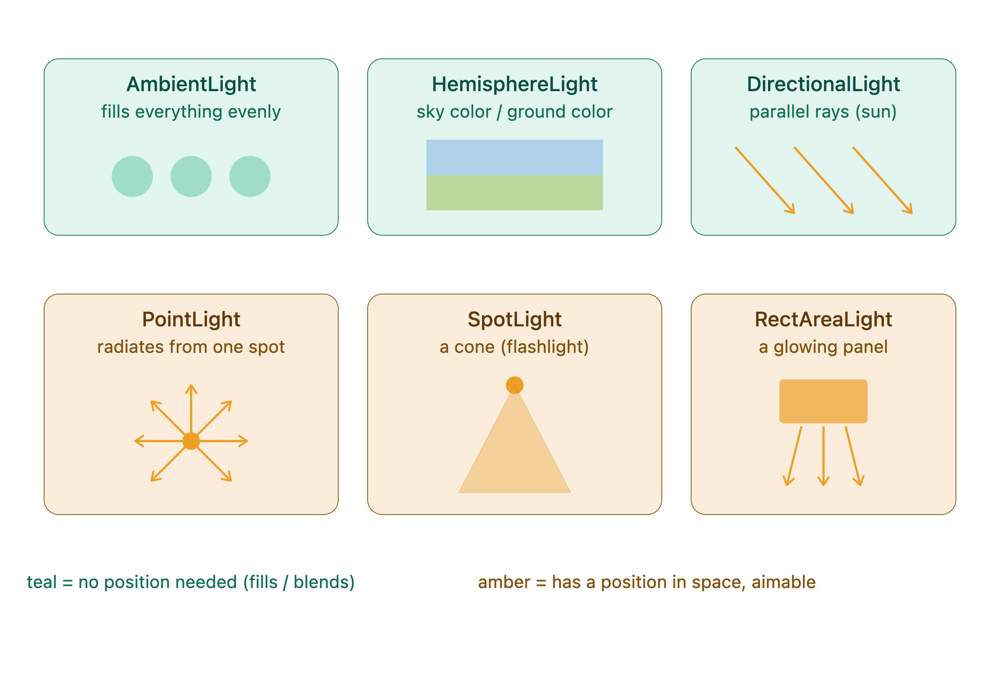

<br/>

1. **Direct lighting**: light rays that come directly from the bulb and hit an object.

1. **Indirect lighting**: light rays that have bounced off the walls and other objects in the room before hitting an object, changing color, and losing intensity with each bounce.

1. **Direct lights**, which simulate direct lighting.

1. **Ambient lights**, which are a cheap and *somewhat* believable way of faking indirect lighting.




```javascript
new THREE.HemisphereLight(skyColor, groundColor, intensity)
```

<br/>


```javascript
new THREE.RectAreaLight(color, intensity, width, height)
```


```javascript
rectAreaLight.position.set(-1.5, 0, 1.5)
rectAreaLight.lookAt(new THREE.Vector3())   // aim at the center (0,0,0)
```

<br/>


```javascript
new THREE.SpotLight(color, intensity, distance, angle, penumbra, decay)
```

- `angle` — how wide the cone opens

- `penumbra` — how soft/blurry the cone's edge is (0 = sharp circle, 1 = very feathered)

- `distance`/`decay` — same fade concepts as PointLight

<br/>

## **Performance**

- AmbientLight

- HemisphereLight

- DirectionalLight

- PointLight

- SpotLight

- RectAreaLight

<br/>

---

<br/>

- [HemisphereLightHelper](https://threejs.org/docs/index.html#api/en/helpers/HemisphereLightHelper)

- [DirectionalLightHelper](https://threejs.org/docs/index.html#api/en/helpers/DirectionalLightHelper)

- [PointLightHelper](https://threejs.org/docs/index.html#api/en/helpers/PointLightHelper)

- [RectAreaLightHelper](https://threejs.org/docs/index.html#examples/en/helpers/RectAreaLightHelper)

- [SpotLightHelper](https://threejs.org/docs/index.html#api/en/helpers/SpotLightHelper)


```javascript
const hemisphereLightHelper = new THREE.HemisphereLightHelper(hemisphereLight, 0.2)
scene.add(hemisphereLightHelper)

const directionalLightHelper = new THREE.DirectionalLightHelper(directionalLight, 0.2)
scene.add(directionalLightHelper)

const pointLightHelper = new THREE.PointLightHelper(pointLight, 0.2)
scene.add(pointLightHelper)

const spotLightHelper = new THREE.SpotLightHelper(spotLight)
scene.add(spotLightHelper)
```

<br/>

