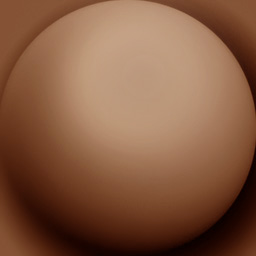

<br/>

---

<br/>


```javascript
/**
 * Objects
 */
// MeshBasicMaterial
const material = new THREE.MeshBasicMaterial()

const sphere = new THREE.Mesh(
    new THREE.SphereGeometry(0.5, 16, 16),
    material
)
sphere.position.x = - 1.5

const plane = new THREE.Mesh(
    new THREE.PlaneGeometry(1, 1),
    material
)

const torus = new THREE.Mesh(
    new THREE.TorusGeometry(0.3, 0.2, 16, 32),
    material
)
torus.position.x = 1.5

scene.add(sphere, plane, torus)
```

<br/>


```javascript
/**
 * Textures
 */
const textureLoader = new THREE.TextureLoader()

const doorColorTexture = textureLoader.load('./textures/door/color.jpg')
const doorAlphaTexture = textureLoader.load('./textures/door/alpha.jpg')
const doorAmbientOcclusionTexture = textureLoader.load('./textures/door/ambientOcclusion.jpg')
const doorHeightTexture = textureLoader.load('./textures/door/height.jpg')
const doorNormalTexture = textureLoader.load('./textures/door/normal.jpg')
const doorMetalnessTexture = textureLoader.load('./textures/door/metalness.jpg')
const doorRoughnessTexture = textureLoader.load('./textures/door/roughness.jpg')
const matcapTexture = textureLoader.load('./textures/matcaps/1.png')
const gradientTexture = textureLoader.load('./textures/gradients/3.jpg')
```


```javascript
doorColorTexture.colorSpace = THREE.SRGBColorSpace
matcapTexture.colorSpace = THREE.SRGBColorSpace
```


```javascript
const material = new THREE.MeshBasicMaterial({ map: doorColorTexture })
```

---

# **MeshBasicMaterial **


```javascript

**const material = new THREE.MeshBasicMaterial({
    map: doorColorTexture
})

// Equivalent
const material = new THREE.MeshBasicMaterial()
material.map = doorColorTexture**
```

<br/>


```javascript
material.map = doorColorTexture
```


```javascript
// material.map = doorColorTexture
material.color = new THREE.Color('#ff0000')
material.color = new THREE.Color('#f00')
material.color = new THREE.Color('red')
material.color = new THREE.Color('rgb(255, 0, 0)')
material.color = new THREE.Color(0xff0000)
```


```javascript
material.map = doorColorTexture
material.color = new THREE.Color('#ff0000')
```


```javascript
// material.map = doorColorTexture
// material.color = new THREE.Color('#ff0000')
material.wireframe = true
```


```javascript
// material.map = doorColorTexture
// material.color = new THREE.Color('#ff0000')
// material.wireframe = true
material.transparent = true
material.opacity = 0.5
```

<br/>


```javascript
// material.map = doorColorTexture
// material.color = new THREE.Color('#ff0000')
// material.wireframe = true
material.transparent = true
// material.opacity = 0.5
material.alphaMap = doorAlphaTexture
```

<br/>


```javascript
// material.map = doorColorTexture
// material.color = new THREE.Color('#ff0000')
// material.wireframe = true
// material.transparent = true
// material.opacity = 0.5
// material.alphaMap = doorAlphaTexture
material.side = THREE.DoubleSide
```

<br/>

<br/>


```javascript
// // MeshBasicMaterial
// const material = new THREE.MeshBasicMaterial()
// material.map = doorColorTexture
// material.color = new THREE.Color('#ff0000')
// material.wireframe = true
// material.transparent = true
// material.opacity = 0.5
// material.alphaMap = doorAlphaTexture
// material.side = THREE.DoubleSide

// MeshNormalMaterial
const material = new THREE.MeshNormalMaterial()
```


```javascript
material.flatShading = true
```

<br/>




```javascript
// // MeshNormalMaterial
// const material = new THREE.MeshNormalMaterial()
// material.flatShading = true

// MeshMatcapMaterial
const material = new THREE.MeshMatcapMaterial()
material.matcap = matcapTexture
```

<br/>


```javascript
// // MeshMatcapMaterial
// const material = new THREE.MeshMatcapMaterial()
// material.matcap = matcapTexture

// MeshDepthMaterial
const material = new THREE.MeshDepthMaterial()
```

<br/>


```javascript
// // MeshDepthMaterial
// const material = new THREE.MeshDepthMaterial()

// MeshLambertMaterial
const material = new THREE.MeshLambertMaterial()
```

<br/>

---

<br/>


```javascript
/**
 * Lights
 */
const ambientLight = new THREE.AmbientLight(0xffffff, 1)
scene.add(ambientLight)
```


```javascript
// ...

const pointLight = new THREE.PointLight(0xffffff, 30)
pointLight.position.x = 2
pointLight.position.y = 3
pointLight.position.z = 4
scene.add(pointLight)
```

<br/>

---


```javascript
// // MeshLambertMaterial
// const material = new THREE.MeshLambertMaterial()

// MeshPhongMaterial
const material = new THREE.MeshPhongMaterial()
```

<br/>


```javascript
material.shininess = 100
material.specular = new THREE.Color(0x1188ff)
```

<br/>


```javascript
// // MeshPhongMaterial
// const material = new THREE.MeshPhongMaterial()
// material.shininess = 100
// material.specular = new THREE.Color(0x1188ff)

// MeshToonMaterial
const material = new THREE.MeshToonMaterial()
```


```javascript
material.gradientMap = gradientTexture
```


```javascript
// MeshToonMaterial
const material = new THREE.MeshToonMaterial()
gradientTexture.minFilter = THREE.NearestFilter
gradientTexture.magFilter = THREE.NearestFilter
material.gradientMap = gradientTexture
```

<br/>


```javascript
**gradientTexture.minFilter = THREE.NearestFilter
gradientTexture.magFilter = THREE.NearestFilter
gradientTexture.generateMipmaps = false**
```


```javascript
**const gradientTexture = textureLoader.load('/textures/gradients/5.jpg')**
```


```javascript
**// // MeshToonMaterial
// const material = new THREE.MeshToonMaterial()
// gradientTexture.minFilter = THREE.NearestFilter
// gradientTexture.magFilter = THREE.NearestFilter
// gradientTexture.generateMipmaps = false
// material.gradientMap = gradientTexture

// MeshStandardMaterial
const material = new THREE.MeshStandardMaterial()**
```


```javascript

**const material = new THREE.MeshStandardMaterial()
material.metalness = 0.45
material.roughness = 0.65

gui.add(material, 'metalness').min(0).max(1).step(0.0001)
gui.add(material, 'roughness').min(0).max(1).step(0.0001)**
```


```javascript

**const material = new THREE.MeshStandardMaterial()
material.metalness = 0.7
material.roughness = 0.2**
```


