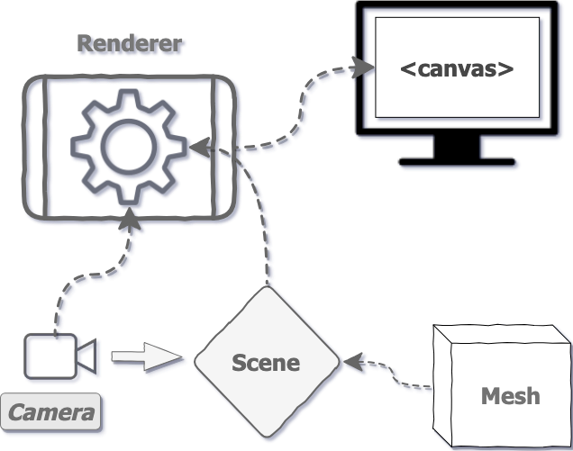

# File Setup

1.  **New project folder** — just a folder on your machine. Open a terminal, `cd` into it.


1. **package.json** — `npm init -y` generates a starter one. Then `npm install three vite` pulls in both packages and creates `node_modules` + a lockfile. **Then by hand, add the two scripts:

**`"scripts": {
  "dev": "vite",
  "build": "vite build"
}` 


1. **index.html** — needs a canvas and a script tag pointing at your entry file:

`<canvas class="webgl"></canvas>
<script type="module" src="./script.js"></script>`


1. `type="module"`  it's what lets `script.js` use `import` syntax at all.


1. **script.js** — this is the four pieces we've already gone through: **Scene, Object, Camera, Renderer**, in that order, because each one depends on the last existing first.


1. `**npm run dev**` — starts Vite's local server and prints a `localhost` link in your terminal. Open it, and you're looking at whatever `renderer.render()` drew.


1. **Instantiating lil-gui **


```javascript
import './style.css'
import * as THREE from 'three'
import { OrbitControls } from 'three/examples/jsm/controls/OrbitControls.js'
import gsap from 'gsap'
import GUI from 'lil-gui'

// ...
```


```javascript
/**
 * Debug
 */
const gui = new GUI()
```


```javascript
import * as dat from 'lil-gui'

// ...

const gui = new dat.GUI()
```

<br/>

## **The different types of tweaks **

- **Range** —for numbers with minimum and maximum value

- **Color** —for colors with various formats

- **Text** —for simple texts

- **Checkbox** —for booleans (`**true**` or `**false**`)

- **Select** —for a choice from a list of values

- **Button** —to trigger functions

---

# Three JS Code



## Scene — somewhere to put things


```javascript
const scene = new THREE.Scene()
```

## Objects


```javascript
// Object
// width, height, depth
const geometry = new THREE.BoxGeometry(1, 1, 1) 

const material = new THREE.MeshBasicMaterial({ color: 0xff0000 })

const mesh = new THREE.Mesh(geometry, material)
```


```javascript
scene.add(mesh)
```

## **Camera**


```javascript
// Sizes
const sizes = {
    width: 800,
    height: 600
}

// Camera
const camera = new THREE.PerspectiveCamera(75, sizes.width / sizes.height)

scene.add(camera)
```

<br/>

<br/>

## **Renderer**


```html
<canvas class="webgl"></canvas>
```

<br/>


```javascript
// Canvas
const canvas = document.querySelector('canvas.webgl')

// scene, object, camera 


// Renderer
const renderer = new THREE.WebGLRenderer({
    canvas: canvas
})
renderer.setSize(sizes.width, sizes.height)
```

### **First render**


```javascript
renderer.render(scene, camera)
```


```javascript
const camera = new THREE.PerspectiveCamera(75, sizes.width / sizes.height)
camera.position.z = 3
scene.add(camera)
```


