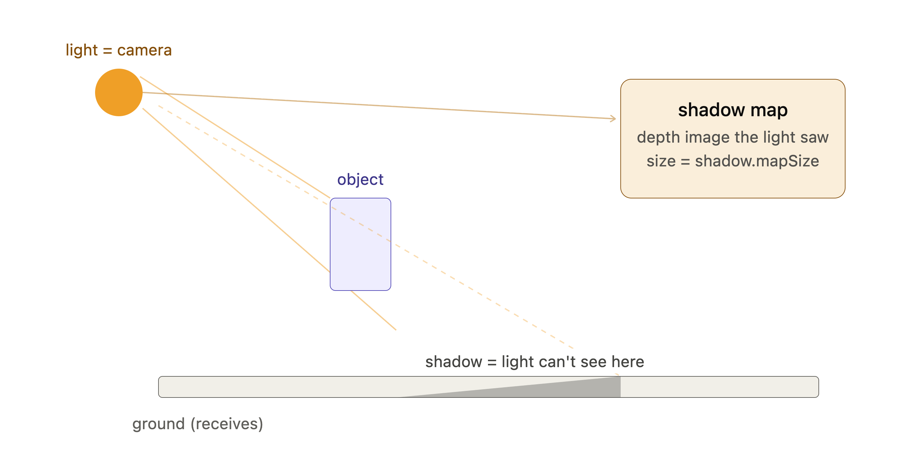

<br/>



<br/>


```javascript
const renderer = new THREE.WebGLRenderer({
    canvas: canvas
})
renderer.shadowMap.enabled = true
```

<br/>

<br/>

- [PointLight](https://threejs.org/docs/index.html#api/en/lights/PointLight)

- [DirectionalLight](https://threejs.org/docs/index.html#api/en/lights/DirectionalLight)

- [SpotLight](https://threejs.org/docs/index.html#api/en/lights/SpotLight)

<br/>


```javascript
const directionalLight = new THREE.DirectionalLight(0xffffff, 1.5)
directionalLight.castShadow = true
```


```javascript
directionalLight.shadow.mapSize.width = 1024
directionalLight.shadow.mapSize.height = 1024
```

<br/>


```javascript
const directionalLight = new THREE.DirectionalLight(0xffffff, 1.5)
// ...
directionalLight.shadow.camera.near = 1
directionalLight.shadow.camera.far = 6
// ...

const directionalLightCameraHelper = new THREE.CameraHelper(directionalLight.shadow.camera)
```

<br/>

### **Amplitude**


```javascript
const directionalLight = new THREE.DirectionalLight(0xffffff, 1.5)
// ...
directionalLight.shadow.camera.top = 2
directionalLight.shadow.camera.right = 2
directionalLight.shadow.camera.bottom = - 2
directionalLight.shadow.camera.left = - 2
```

<br/>

## Blur


```javascript
const directionalLight = new THREE.DirectionalLight(0xffffff, 1.5)
// ...
directionalLight.shadow.radius = 10
```

---

<br/>

- **THREE.BasicShadowMap: **Very performant but lousy quality

- **THREE.PCFShadowMap: **Less performant but smoother edges

- **THREE.PCFSoftShadowMap: **Less performant but even softer edges

- **THREE.VSMShadowMap: **Less performant, more constraints, can have unexpected results


```javascript
const renderer = new THREE.WebGLRenderer({
    canvas: canvas
})
renderer.shadowMap.enabled = true
renderer.shadowMap.type = THREE.PCFSoftShadowMap
```

