---

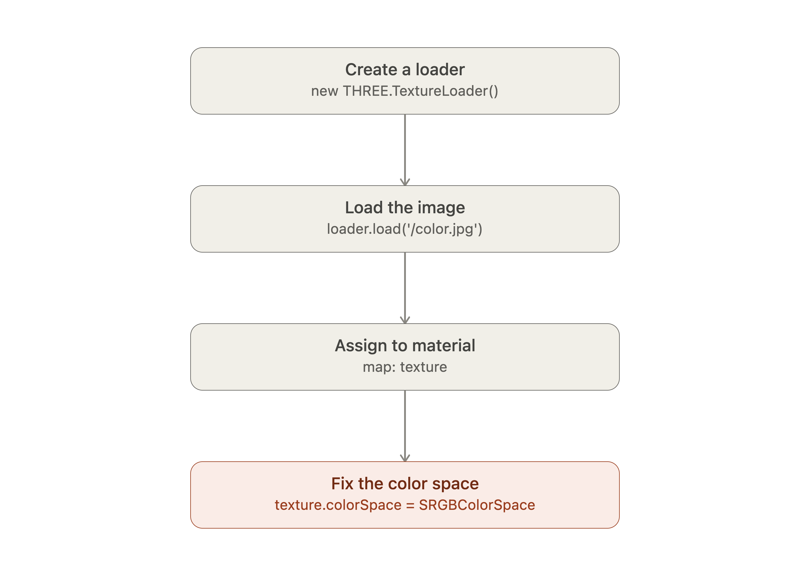

### **Color (or albedo) **

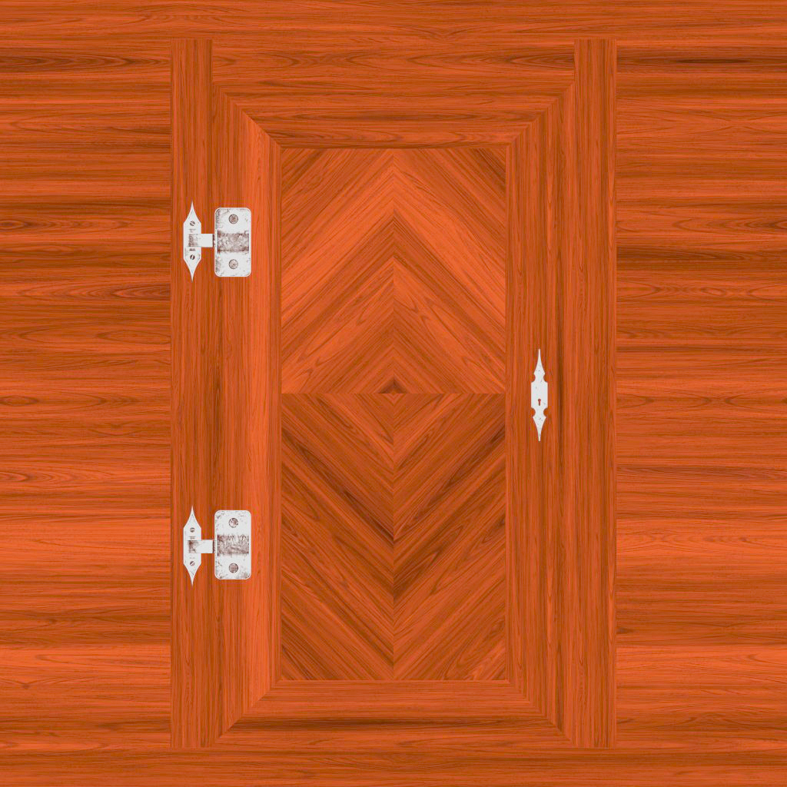

### **Alpha **


### **Height **

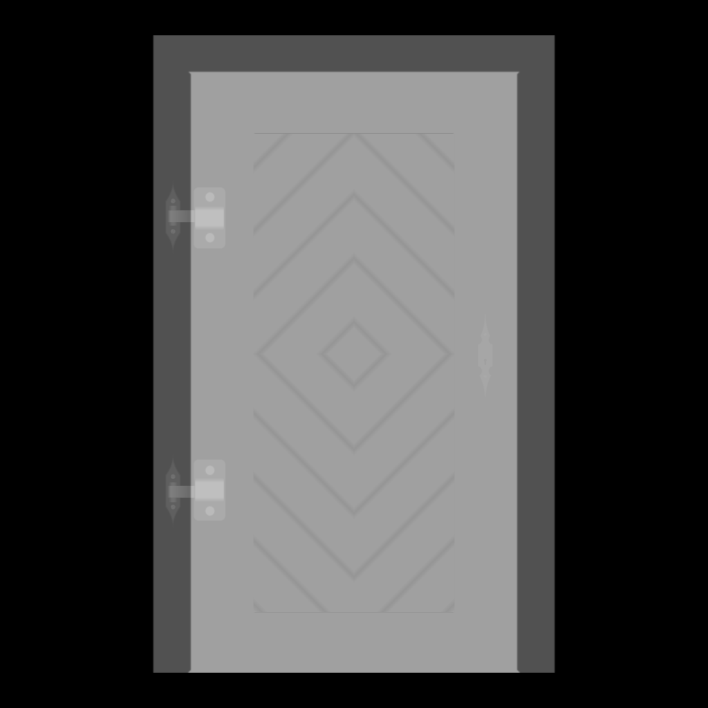

### **Normal **

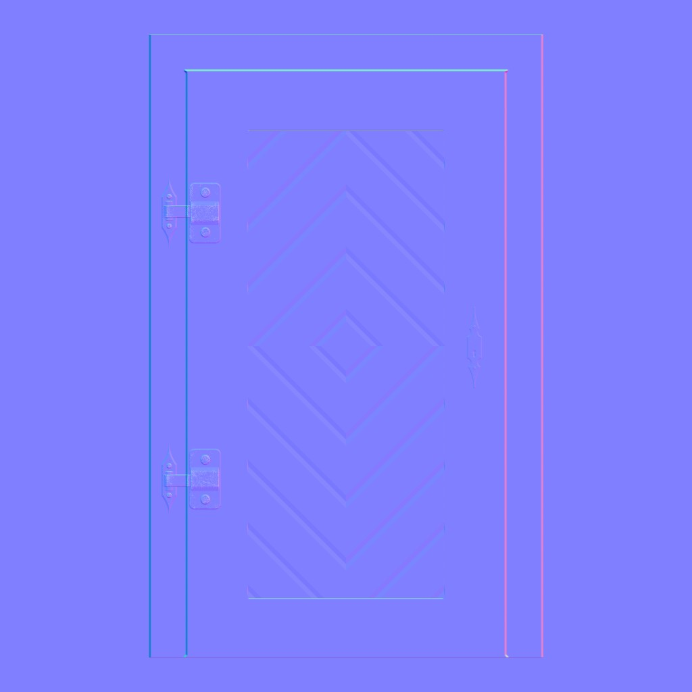

### **Ambient occlusion **

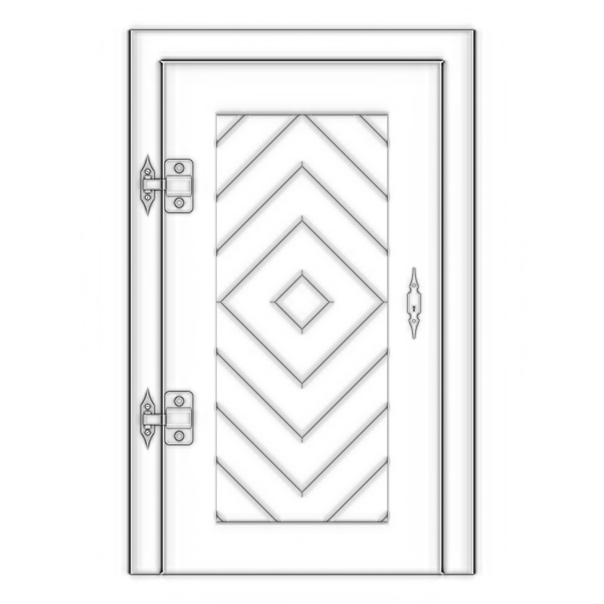

### **Metalness **

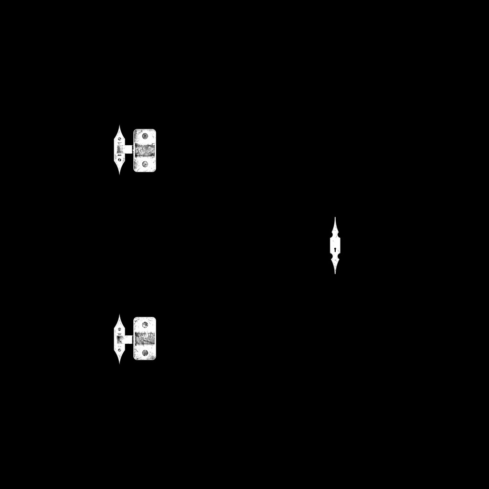

### **Roughness **

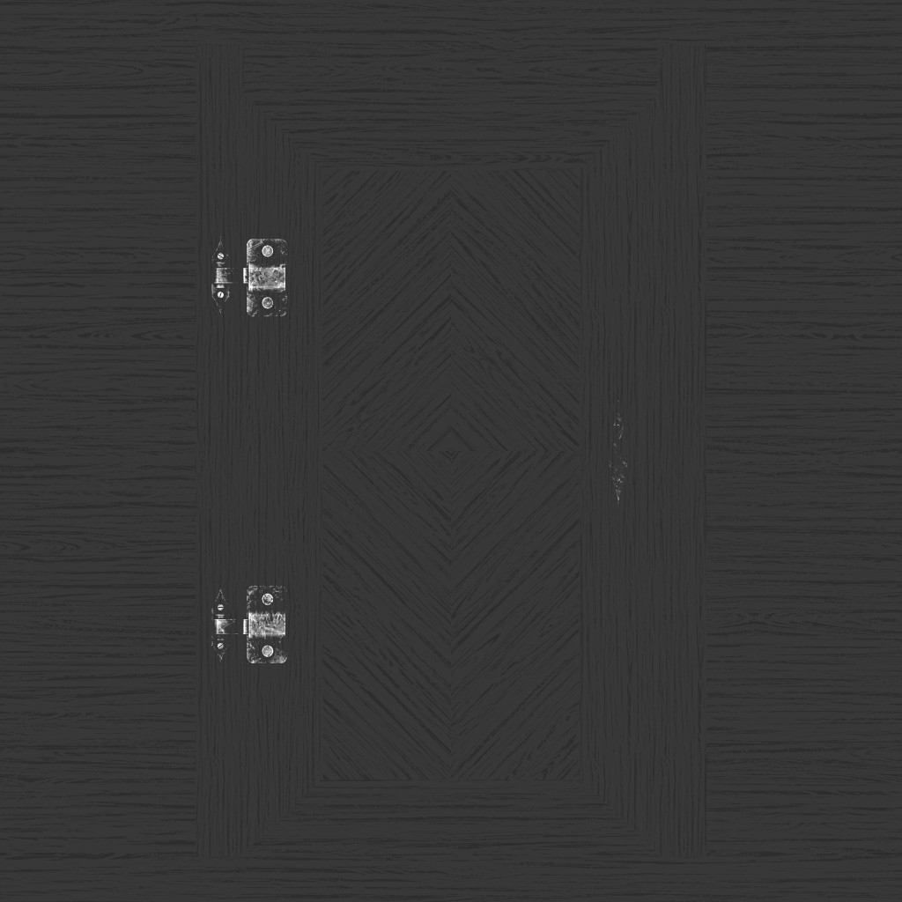

### **PBR **

- [https://marmoset.co/posts/basic-theory-of-physically-based-rendering/](https://marmoset.co/posts/basic-theory-of-physically-based-rendering/)

- [https://marmoset.co/posts/physically-based-rendering-and-you-can-too/](https://marmoset.co/posts/physically-based-rendering-and-you-can-too/)

---

## **How to load textures**

### **Getting the URL of the image **


```javascript
import imageSource from './image.png'

console.log(imageSource)
```


```javascript
const imageSource = '/image.png'

console.log(imageSource)
```

### **Loading the image **

[//]: # (heading_4 is not supported)


```javascript
const image = new Image()
image.addEventListener('load', () =>
{
    const texture = new THREE.Texture(image)
})
image.src = '/textures/door/color.jpg'
```


```javascript
const image = new Image()
const texture = new THREE.Texture(image)

image.addEventListener('load', () =>
{
    texture.needsUpdate = true
})
image.src = '/textures/door/color.jpg'
```


```javascript
const material = new THREE.MeshBasicMaterial({ map: texture })
```

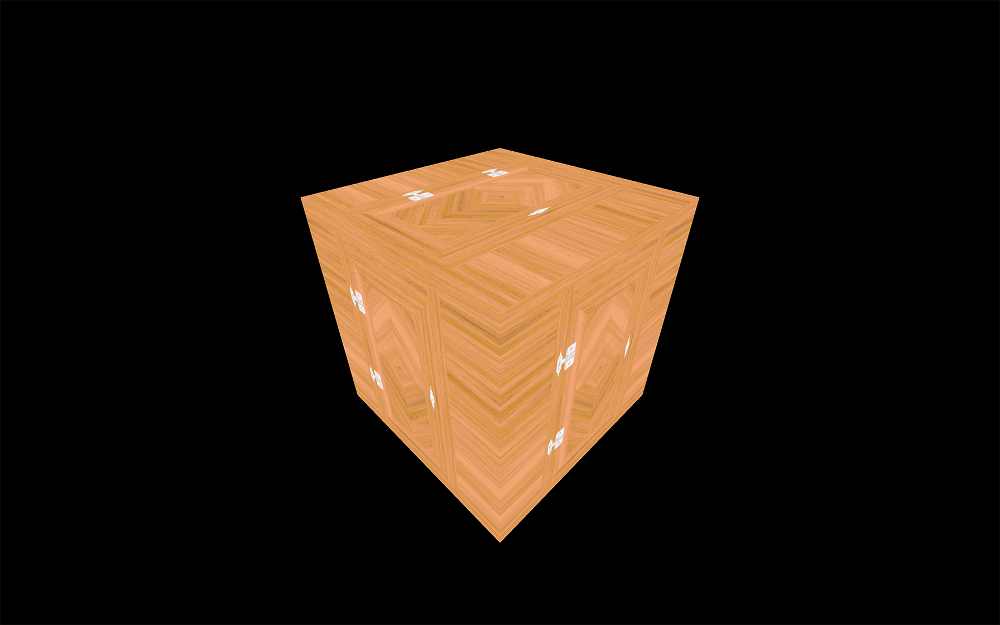


```javascript
const texture = new THREE.Texture(image)
texture.colorSpace = THREE.SRGBColorSpace
```

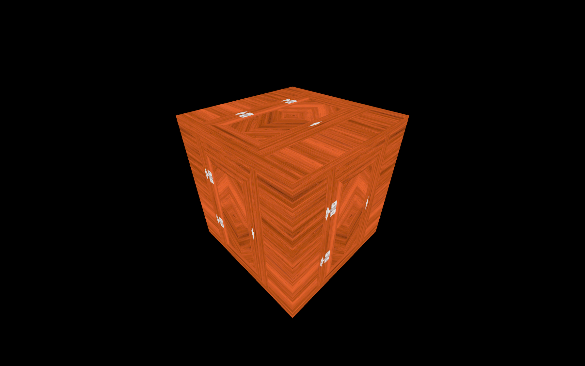

<br/>

## **Using TextureLoader **


```javascript
const textureLoader = new THREE.TextureLoader()
const texture = textureLoader.load('/textures/door/color.jpg')
texture.colorSpace = THREE.SRGBColorSpace
```

- `**load**` when the image loaded successfully

- `**progress**` when the loading is progressing

- `**error**` if something went wrong


```javascript
const textureLoader = new THREE.TextureLoader()
const texture = textureLoader.load(
    '/textures/door/color.jpg',
    () =>
    {
        console.log('loading finished')
    },
    () =>
    {
        console.log('loading progressing')
    },
    () =>
    {
        console.log('loading error')
    }
)
texture.colorSpace = THREE.SRGBColorSpace
```

[//]: # (heading_4 is not supported)


```javascript
const loadingManager = new THREE.LoadingManager()
const textureLoader = new THREE.TextureLoader(loadingManager)
```


```javascript
const loadingManager = new THREE.LoadingManager()
loadingManager.onStart = () =>
{
    console.log('loading started')
}
loadingManager.onLoad = () =>
{
    console.log('loading finished')
}
loadingManager.onProgress = () =>
{
    console.log('loading progressing')
}
loadingManager.onError = () =>
{
    console.log('loading error')
}

const textureLoader = new THREE.TextureLoader(loadingManager)
```


```javascript
// ...

const colorTexture = textureLoader.load('/textures/door/color.jpg')
colorTexture.colorSpace = THREE.SRGBColorSpace
const alphaTexture = textureLoader.load('/textures/door/alpha.jpg')
const heightTexture = textureLoader.load('/textures/door/height.jpg')
const normalTexture = textureLoader.load('/textures/door/normal.jpg')
const ambientOcclusionTexture = textureLoader.load('/textures/door/ambientOcclusion.jpg')
const metalnessTexture = textureLoader.load('/textures/door/metalness.jpg')
const roughnessTexture = textureLoader.load('/textures/door/roughness.jpg')
```


```javascript
const material = new THREE.MeshBasicMaterial({ map: colorTexture })
```

---

## **UV unwrapping **


```javascript
const geometry = new THREE.BoxGeometry(1, 1, 1)

// Or
const geometry = new THREE.SphereGeometry(1, 32, 32)

// Or
const geometry = new THREE.ConeGeometry(1, 1, 32)

// Or
const geometry = new THREE.TorusGeometry(1, 0.35, 32, 100)
```

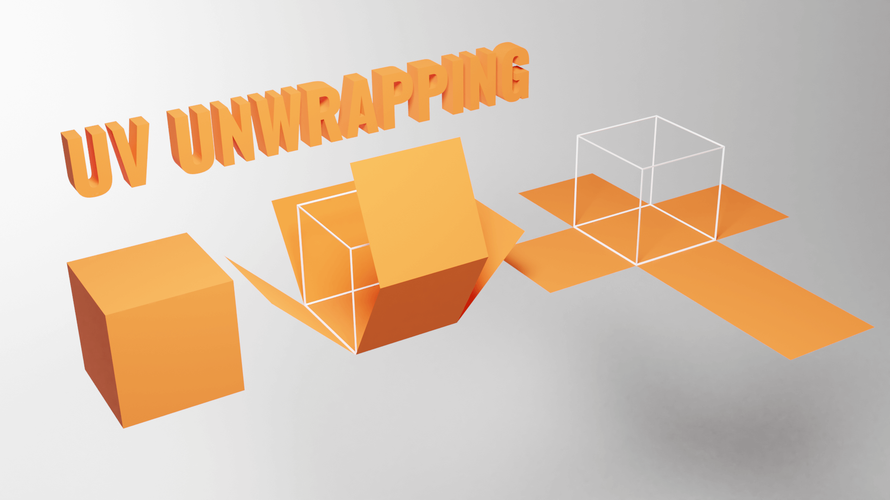


```javascript
console.log(geometry.attributes.uv)
```

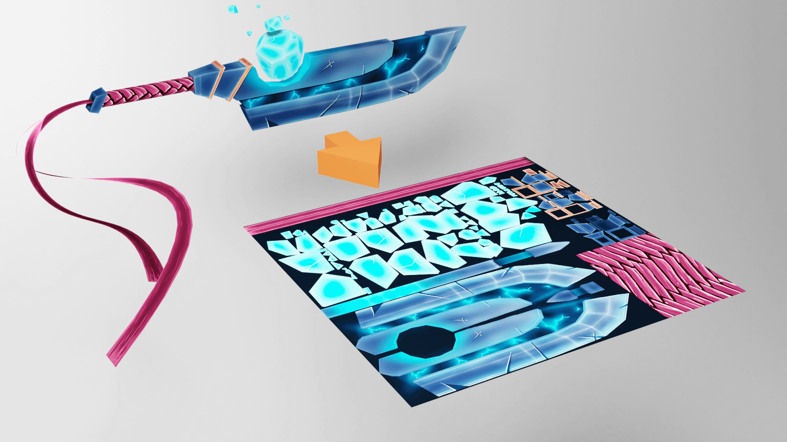

## **Transforming the texture **

### **Repeat **


```javascript
const colorTexture = textureLoader.load('/textures/door/color.jpg')
colorTexture.colorSpace = THREE.SRGBColorSpace
colorTexture.repeat.x = 2
colorTexture.repeat.y = 3
```

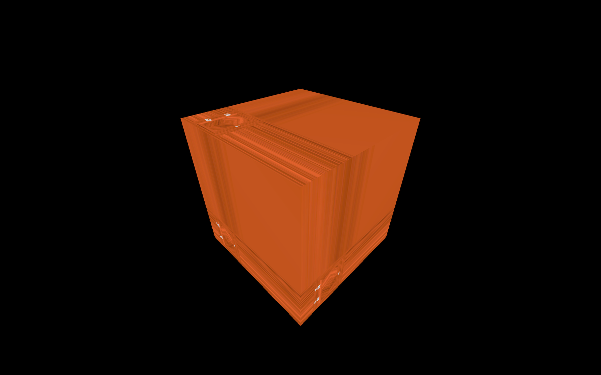

- `**wrapS**` is for the `**x**` axis

- `**wrapT**` is for the `**y**` axis


```javascript
colorTexture.wrapS = THREE.RepeatWrapping
colorTexture.wrapT = THREE.RepeatWrapping
```

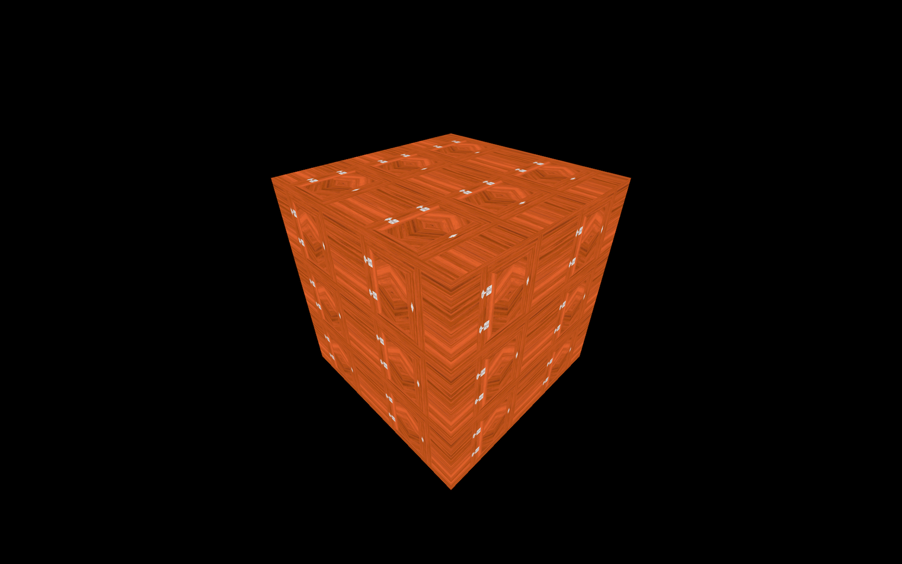


```javascript
colorTexture.wrapS = THREE.MirroredRepeatWrapping
colorTexture.wrapT = THREE.MirroredRepeatWrapping
```

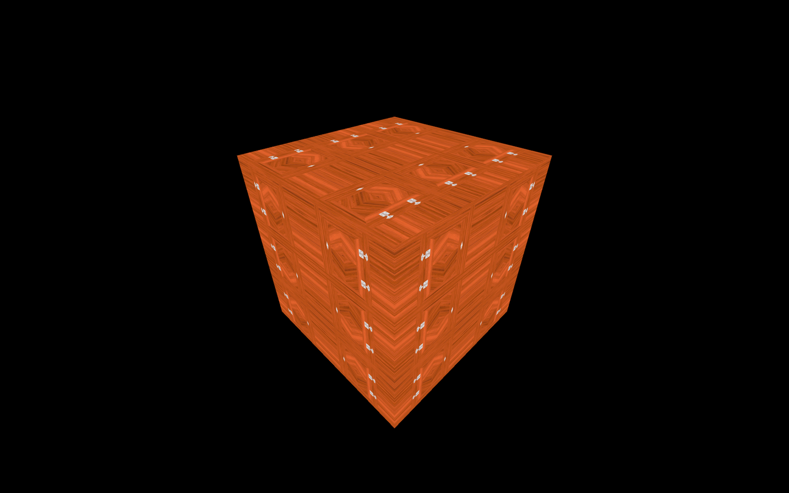

### **Offset **


```javascript
colorTexture.offset.x = 0.5
colorTexture.offset.y = 0.5
```

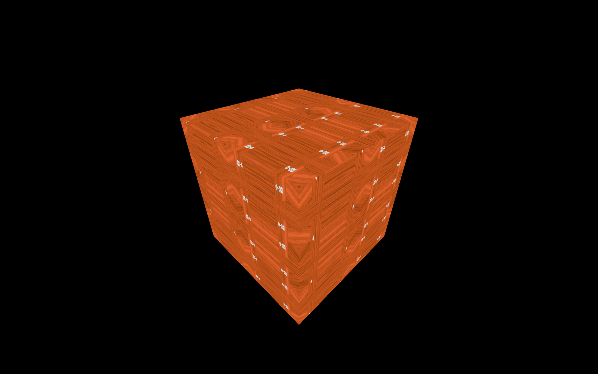

### **Rotation **


```javascript
colorTexture.rotation = Math.PI * 0.25
```

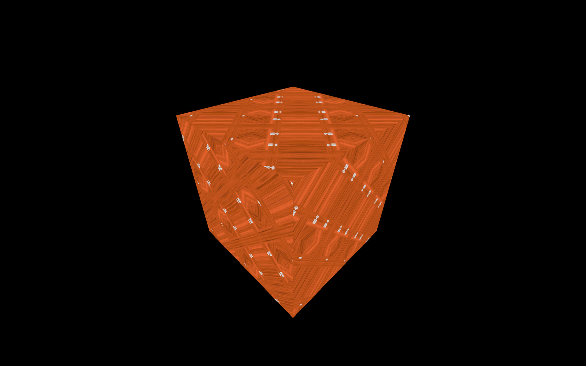

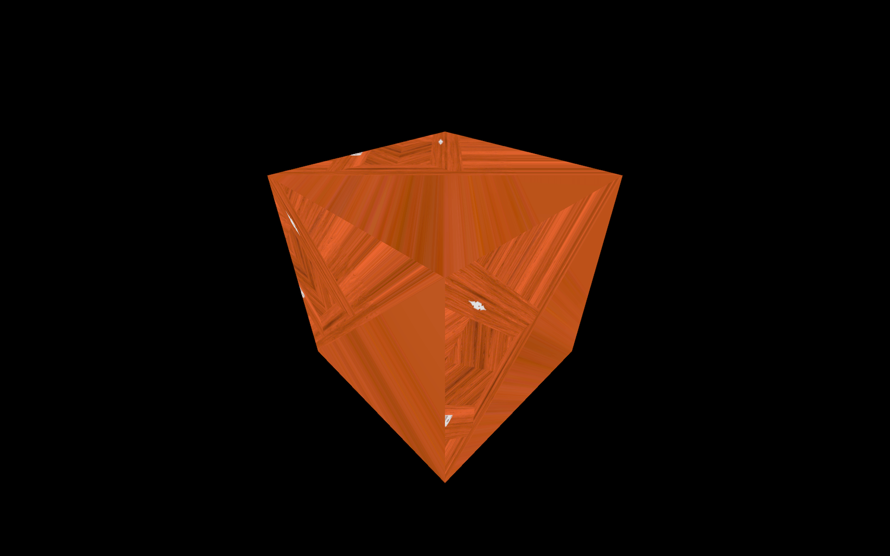


```javascript
colorTexture.rotation = Math.PI * 0.25
colorTexture.center.x = 0.5
colorTexture.center.y = 0.5
```

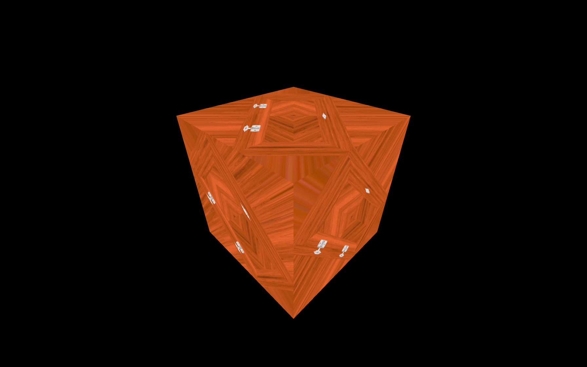

## **Filtering and Mipmapping **

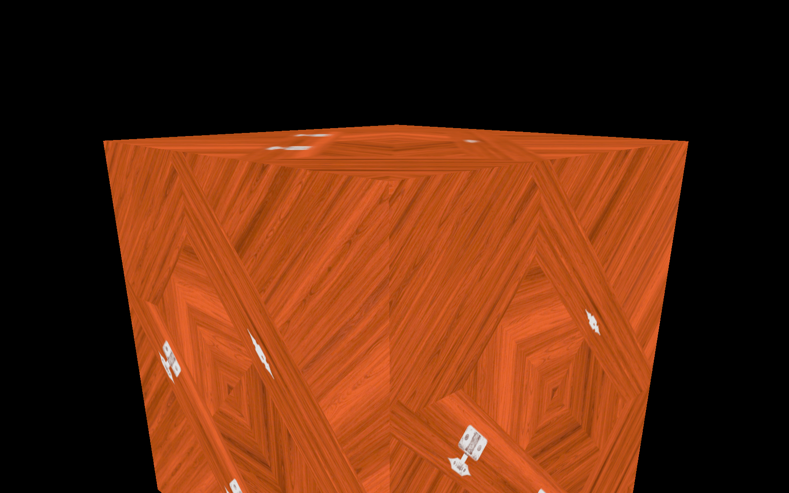

### **Minification filter **

- `**THREE.NearestFilter**`

- `**THREE.LinearFilter**`

- `**THREE.NearestMipmapNearestFilter**`

- `**THREE.NearestMipmapLinearFilter**`

- `**THREE.LinearMipmapNearestFilter**`

- `**THREE.LinearMipmapLinearFilter**`


```javascript
colorTexture.minFilter = THREE.NearestFilter
```


```javascript
const colorTexture = textureLoader.load('/textures/checkerboard-1024x1024.png')
```

### **Magnification filter **


```javascript
const colorTexture = textureLoader.load('/textures/checkerboard-8x8.png')
```

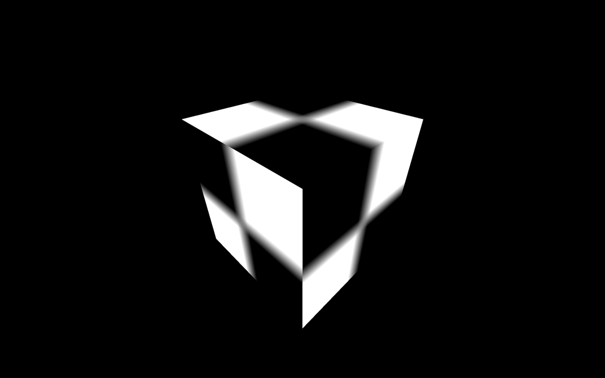

- `**THREE.NearestFilter**`

- `**THREE.LinearFilter**`


```javascript
colorTexture.magFilter = THREE.NearestFilter
```


```javascript
const colorTexture = textureLoader.load('/textures/minecraft.png')
```

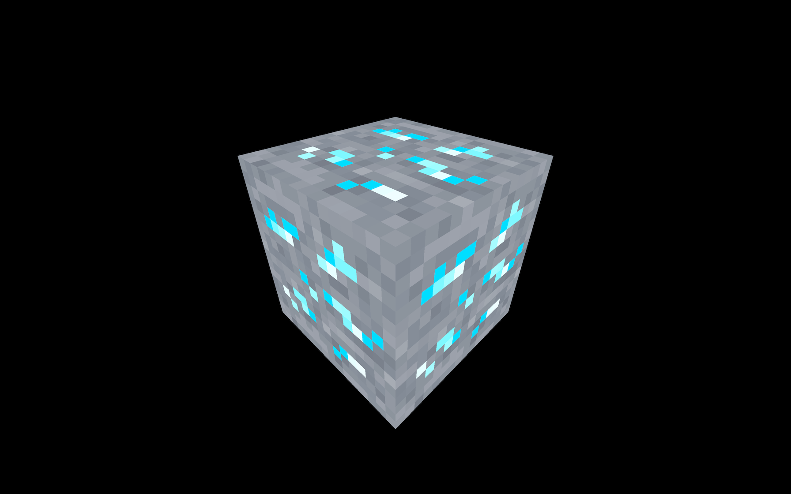


```javascript
colorTexture.generateMipmaps = false
colorTexture.minFilter = THREE.NearestFilter
```

## **Texture format and optimisation **

- The weight

- The size (or the resolution)

- The data

### **The weight **

### **The size **

### **The data **

## **Where to find textures **

- [poliigon.com](http://poliigon.com/)

- [3dtextures.me](http://3dtextures.me/)

- [arroway-textures.ch](http://arroway-textures.ch/)

---


```javascript
import * as THREE from 'three'
import { OrbitControls } from 'three/examples/jsm/controls/OrbitControls.js'

/**
 * Base
 */
// Canvas
const canvas = document.querySelector('canvas.webgl')

// Scene
const scene = new THREE.Scene()

/**
 * Textures
 */
const loadingManager = new THREE.LoadingManager()

//fires once, at the very first load, across all textures.
loadingManager.onStart = () =>
{
    console.log('loadingManager: loading started')
}
//Fires exactly once, only once everything sharing this manager has finished.
loadingManager.onLoad = () =>
{
    console.log('loadingManager: loading finished')
}
// fires once per file as each one completes; up to seven times below.
loadingManager.onProgress = () =>
{
    console.log('loadingManager: loading progressing')
}
// fires per file that fails.
loadingManager.onError = () =>
{
    console.log('loadingManager: loading error')
}


const textureLoader = new THREE.TextureLoader(loadingManager)

// const colorTexture = textureLoader.load('/textures/checkerboard-1024x1024.png')
// const colorTexture = textureLoader.load('/textures/checkerboard-2x2.png')
const colorTexture = textureLoader.load(
    '/textures/minecraft.png',
    () =>
    {
        console.log('textureLoader: loading finished')
    },
    () =>
    {
        console.log('textureLoader: loading progressing')
    },
    () =>
    {
        console.log('textureLoader: loading error')
    }
)
colorTexture.colorSpace = THREE.SRGBColorSpace
colorTexture.wrapS = THREE.MirroredRepeatWrapping
colorTexture.wrapT = THREE.MirroredRepeatWrapping
// colorTexture.repeat.x = 2
// colorTexture.repeat.y = 3
// colorTexture.offset.x = 0.5
// colorTexture.offset.y = 0.5
// colorTexture.rotation = Math.PI * 0.25
// colorTexture.center.x = 0.5
// colorTexture.center.y = 0.5
colorTexture.generateMipmaps = false
colorTexture.minFilter = THREE.NearestFilter
colorTexture.magFilter = THREE.NearestFilter

const alphaTexture = textureLoader.load('/textures/door/alpha.jpg')
const heightTexture = textureLoader.load('/textures/door/height.jpg')
const normalTexture = textureLoader.load('/textures/door/normal.jpg')
const ambientOcclusionTexture = textureLoader.load('/textures/door/ambientOcclusion.jpg')
const metalnessTexture = textureLoader.load('/textures/door/metalness.jpg')
const roughnessTexture = textureLoader.load('/textures/door/roughness.jpg')

/**
 * Object
 */
const geometry = new THREE.BoxGeometry(1, 1, 1)
console.log(geometry.attributes)
const material = new THREE.MeshBasicMaterial({ map: colorTexture })
const mesh = new THREE.Mesh(geometry, material)
scene.add(mesh)

/**
 * Sizes
 */
const sizes = {
    width: window.innerWidth,
    height: window.innerHeight
}

window.addEventListener('resize', () =>
{
    // Update sizes
    sizes.width = window.innerWidth
    sizes.height = window.innerHeight

    // Update camera
    camera.aspect = sizes.width / sizes.height
    camera.updateProjectionMatrix()

    // Update renderer
    renderer.setSize(sizes.width, sizes.height)
    renderer.setPixelRatio(Math.min(window.devicePixelRatio, 2))
})

/**
 * Camera
 */
// Base camera
const camera = new THREE.PerspectiveCamera(75, sizes.width / sizes.height, 0.1, 100)
camera.position.x = 1
camera.position.y = 1
camera.position.z = 1
scene.add(camera)

// Controls
const controls = new OrbitControls(camera, canvas)
controls.enableDamping = true

/**
 * Renderer
 */
const renderer = new THREE.WebGLRenderer({
    canvas: canvas
})
renderer.setSize(sizes.width, sizes.height)
renderer.setPixelRatio(Math.min(window.devicePixelRatio, 2))

/**
 * Animate
 */
const clock = new THREE.Clock()

const tick = () =>
{
    const elapsedTime = clock.getElapsedTime()

    // Update controls
    controls.update()

    // Render
    renderer.render(scene, camera)

    // Call tick again on the next frame
    window.requestAnimationFrame(tick)
}

tick()
```

